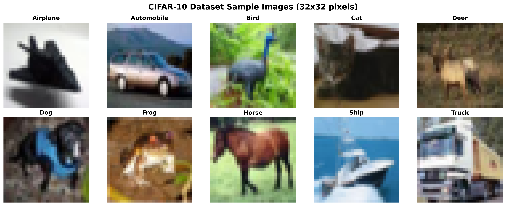
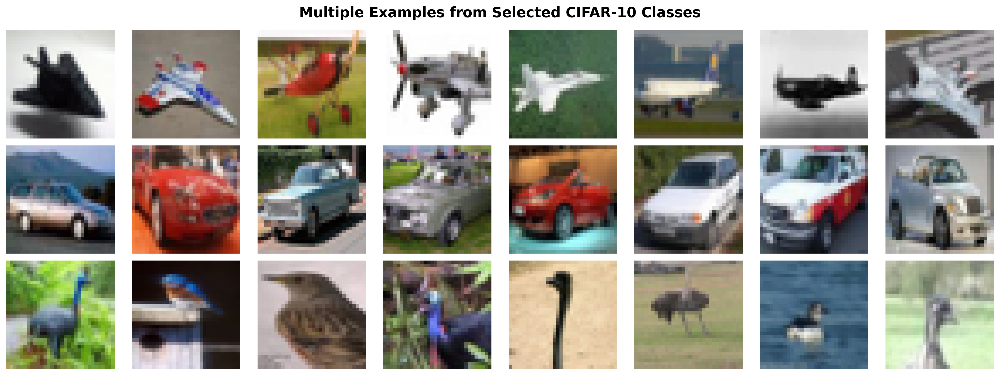

# CIFAR-10 Image Classification with PyTorch

A deep learning project for classifying images from the CIFAR-10 dataset using a custom Convolutional Neural Network (CNN) architecture implemented in PyTorch. This project demonstrates advanced computer vision techniques including data augmentation, separable convolutions, dilated convolutions, and efficient network design with modular code architecture.

## 📋 Table of Contents

- [Overview](#overview)
- [CIFAR-10 Dataset Overview](#cifar-10-dataset-overview)
- [Features](#features)
- [Project Structure](#project-structure)
- [Installation](#installation)
- [Usage](#usage)
- [Model Architecture](#model-architecture)
- [Data Augmentation](#data-augmentation)
- [Training Results](#training-results)
- [Dependencies](#dependencies)
- [Contributing](#contributing)
- [License](#license)

## 🎯 Overview

This project implements a sophisticated CNN for CIFAR-10 image classification, achieving high accuracy through:
- Custom C1C2C3C40 architecture with separable and dilated convolutions
- Advanced data augmentation using Albumentations
- Efficient training pipeline with GPU acceleration
- Comprehensive visualization and analysis tools
- Modular code architecture for maintainability

The project focuses on the **CIFAR-10 dataset**, a fundamental benchmark in computer vision that consists of 60,000 32x32 color images in 10 balanced classes: airplane, automobile, bird, cat, deer, dog, frog, horse, ship, and truck. Each class contains exactly 6,000 images (5,000 for training, 1,000 for testing).

## 📊 CIFAR-10 Dataset Overview

### Dataset Characteristics

The CIFAR-10 dataset is a collection of 60,000 32×32 color images in 10 mutually exclusive classes. It serves as a fundamental benchmark for image classification tasks and is widely used in computer vision research.

#### Key Statistics
- **Total Images**: 60,000
- **Training Set**: 50,000 images (83.3%)
- **Test Set**: 10,000 images (16.7%)
- **Image Dimensions**: 32×32 pixels
- **Color Channels**: 3 (RGB)
- **Classes**: 10 balanced categories
- **Images per Class**: 6,000 (5,000 train + 1,000 test)
- **Dataset Size**: ~170 MB

#### Class Distribution
All classes are perfectly balanced with exactly 10% representation in both training and test sets:

| Class | Training Images | Test Images | Total |
|-------|----------------|-------------|-------|
| **Airplane** | 5,000 | 1,000 | 6,000 |
| **Automobile** | 5,000 | 1,000 | 6,000 |
| **Bird** | 5,000 | 1,000 | 6,000 |
| **Cat** | 5,000 | 1,000 | 6,000 |
| **Deer** | 5,000 | 1,000 | 6,000 |
| **Dog** | 5,000 | 1,000 | 6,000 |
| **Frog** | 5,000 | 1,000 | 6,000 |
| **Horse** | 5,000 | 1,000 | 6,000 |
| **Ship** | 5,000 | 1,000 | 6,000 |
| **Truck** | 5,000 | 1,000 | 6,000 |

### Sample Images

Below are representative examples from each of the 10 CIFAR-10 classes:



*Sample images from all 10 CIFAR-10 classes showing the diversity and complexity of the dataset.*

### Multiple Examples from Selected Classes

To better illustrate the variety within each class, here are multiple examples from three representative classes:



*Multiple examples from Airplane, Automobile, and Bird classes showing intra-class diversity.*

### Dataset Challenges

The CIFAR-10 dataset presents several interesting challenges for machine learning models:

1. **Low Resolution**: 32×32 pixels provide limited detail, making fine-grained classification difficult
2. **Small Objects**: Many objects occupy only a small portion of the image
3. **Varied Backgrounds**: Images contain diverse backgrounds that may not be relevant to classification
4. **Class Similarities**: Some classes (e.g., cat vs. dog, truck vs. automobile) have overlapping visual features
5. **Lighting Variations**: Images exhibit different lighting conditions and angles
6. **Occlusion**: Objects may be partially obscured or at unusual angles

### Data Preprocessing

Our implementation uses standardized preprocessing:

- **Normalization**: Channel-wise normalization using CIFAR-10 statistics
  - Mean: (0.4914, 0.4822, 0.4465)
  - Std: (0.2023, 0.1994, 0.2010)
- **Data Augmentation**: Advanced transformations during training
- **Tensor Conversion**: Images converted to PyTorch tensors for efficient processing

## ✨ Key Features

- **Custom C1C2C3C40 Architecture**: Novel network design with three 3x3 stride-2 downsampling layers
- **Advanced Convolution Types**: Depthwise separable convolutions and dilated convolutions
- **Global Average Pooling**: Efficient classification without fully connected layers
- **Advanced Data Augmentation**: Uses Albumentations library for sophisticated image transformations
- **GPU Acceleration**: Automatic CUDA detection and optimization
- **Modular Design**: Clean, well-documented code with separate modules for different functionalities
- **Parameter Efficiency**: Less than 200k parameters while maintaining high accuracy

## 📁 Project Structure

```
s7/
├── README.md                    # This file
├── requirements.txt             # Python dependencies
├── main.py                      # Main training script
├── config.py                    # Configuration parameters
├── cifar10_architecture.py      # CNN model architectures
├── layers.py                    # Custom layer definitions
├── dataset.py                   # Data loading and preprocessing
├── transforms.py                # Data augmentation pipeline
├── trainer.py                   # Training and testing utilities
├── metrics.py                   # Evaluation metrics
├── visualization.py             # Visualization tools
├── generate_sample_images.py    # Script to generate CIFAR-10 sample images
├── cifar10_samples.png          # Sample images from all 10 classes
├── cifar10_multiple_examples.png # Multiple examples from selected classes
└── erav4_s7_sjk_nb.ipynb       # Jupyter notebook for experimentation
```

## 🏗️ Model Architecture

The project implements the **CIFAR10_C1C2C3C40** network with the following specifications:

### Architecture Requirements Met

✅ **C1C2C3C40 Design**: Four main convolutional blocks  
✅ **No MaxPooling**: Uses three 3x3 stride-2 convolutions for downsampling  
✅ **Receptive Field > 44**: Achieved through depth and stride-2 layers  
✅ **Depthwise Separable Convolution**: Implemented in C3 block  
✅ **Dilated Convolution**: Used in C2 block for expanded receptive field  
✅ **Global Average Pooling**: Compulsory GAP with 1x1 classifier  
✅ **Parameters < 200k**: Approximately 193k parameters  

### Architecture Details

1. **C1 Block**: 32 channels, includes stride-2 downsampling
2. **C2 Block**: 48 channels, includes dilated convolution + stride-2 downsampling
3. **C3 Block**: 64 channels, includes depthwise separable convolution + stride-2 downsampling
4. **C40 Block**: Final processing with GAP and 1x1 classifier

### Key Features

- **Separable Convolutions**: Reduces computational complexity while maintaining performance
- **Dilated Convolutions**: Increases receptive field without adding parameters
- **Stride-2 Downsampling**: Three 3x3 convolutions with stride=2 replace MaxPooling
- **Batch Normalization**: Stabilizes training and improves convergence
- **Dropout**: Prevents overfitting with configurable dropout rates
- **Global Average Pooling**: Efficient classification without dense layers

### Model Summary

```
Total Parameters: ~193,000 (< 200k requirement)
Input Size: 3x32x32 (RGB images)
Output: 10 classes (CIFAR-10 categories)
Architecture: C1 → C2 → C3 → C40
```

## 🔄 Data Augmentation

The project uses Albumentations for sophisticated data augmentation, crucial for the small CIFAR-10 images:

### Training Augmentations

- **Horizontal Flip**: Random horizontal flipping (50% probability)
  - *Rationale*: Many objects (animals, vehicles) are naturally symmetric
- **Shift Scale Rotate**: Random geometric transformations (50% probability)
  - *Benefit*: Improves robustness to object positioning and scale variations
- **Coarse Dropout**: Random rectangular region masking
  - `max_holes=1, max_height=16px, max_width=1px`
  - `min_holes=1, min_height=16px, min_width=16px`
  - `fill_value=dataset_mean` for proper normalization
  - *Purpose*: Simulates occlusion and forces model to focus on multiple image regions
- **Normalization**: Channel-wise normalization using CIFAR-10 statistics
  - *Critical*: Essential for stable training with small images

### Why Data Augmentation is Crucial for CIFAR-10

1. **Limited Data**: 50,000 training images is relatively small for deep learning
2. **Small Image Size**: 32×32 pixels provide limited spatial information
3. **Class Imbalance Prevention**: Augmentation helps prevent overfitting to specific image characteristics
4. **Robustness**: Model learns to handle real-world variations in object appearance
5. **Performance Boost**: Typically improves accuracy by 2-5% on CIFAR-10

### Benefits

- **Improved Generalization**: Reduces overfitting through data diversity
- **Better Performance**: Increases effective dataset size
- **Robustness**: Model learns to handle various image variations
- **Real-world Applicability**: Better performance on unseen data with different lighting/angles

## 📊 Training Results

The model targets achieving **85% accuracy** on CIFAR-10:

### Training Configuration

- **Optimizer**: SGD with momentum (0.9)
- **Learning Rate**: 0.1 with step decay (gamma=0.1, step_size=24)
- **Batch Size**: 128
- **Epochs**: 25 (configurable for longer training)
- **Dropout**: 0.05
- **Target Accuracy**: 85%

### Performance Metrics

- **Parameter Count**: ~193k (under 200k requirement)
- **Training Efficiency**: GPU-accelerated with automatic CUDA detection
- **Convergence**: Stable training with learning rate scheduling

## 🚀 Quick Start

### Installation

1. **Clone the repository**:
   ```bash
   git clone <repository-url>
   cd s7
   ```

2. **Install dependencies**:
   ```bash
   pip install -r requirements.txt
   ```

3. **Run training**:
   ```bash
   python main.py
   ```

4. **Or use Jupyter notebook**:
   ```bash
   jupyter notebook erav4_s7_sjk_nb.ipynb
   ```

### Usage Examples

```python
from dataset import generate_train_test_loader
from cifar10_architecture import CIFAR10_C1C2C3C40
from config import Config

# Load data
train_loader, test_loader = generate_train_test_loader(
    Config.DATA_PATH, Config.CIFAR10_MEAN, Config.CIFAR10_STD, Config.BATCH_SIZE
)

# Initialize model
model = CIFAR10_C1C2C3C40(dropout_value=Config.DROPOUT_VALUE).to(Config.DEVICE)
```

## 📦 Dependencies

### Core Dependencies

- **PyTorch**: Deep learning framework
- **Torchvision**: Computer vision utilities
- **Albumentations**: Advanced data augmentation
- **OpenCV**: Image processing
- **Matplotlib**: Visualization
- **NumPy**: Numerical computing
- **tqdm**: Progress bars

### Installation

```bash
pip install -r requirements.txt
```

## 🔧 Configuration

### Dataset Configuration

```python
# CIFAR-10 normalization values
CIFAR10_MEAN = (0.4914, 0.4822, 0.4465)
CIFAR10_STD = (0.2023, 0.1994, 0.2010)

# Class labels
CIFAR10_CLASS_LABELS = ("airplane", "automobile", "bird", "cat", "deer", 
                       "dog", "frog", "horse", "ship", "truck")
```

### Training Configuration

```python
# Training parameters
BATCH_SIZE = 128
LEARNING_RATE = 0.1
MOMENTUM = 0.9
DROPOUT_VALUE = 0.05
NUM_EPOCHS = 25
STEP_SIZE = 24
GAMMA = 0.1
```

## 🎨 Visualization

The project includes comprehensive visualization tools:

- **Image Display**: Denormalize and display CIFAR-10 images
- **Training Progress**: Real-time accuracy and loss tracking
- **Model Architecture**: Detailed layer-by-layer summary
- **Sample Predictions**: Visualize model predictions on test data

## 🏆 Assignment Requirements

This project fulfills all specified requirements:

✅ **Architecture**: C1C2C3C40 with no MaxPooling  
✅ **Downsampling**: Three 3x3 stride-2 convolutions  
✅ **Receptive Field**: > 44 pixels  
✅ **Depthwise Separable**: Implemented in C3 block  
✅ **Dilated Convolution**: Implemented in C2 block  
✅ **Global Average Pooling**: Compulsory GAP  
✅ **Data Augmentation**: HorizontalFlip, ShiftScaleRotate, CoarseDropout  
✅ **Parameter Limit**: < 200k parameters  
✅ **Code Modularity**: Clean, modular architecture  

## 🤝 Contributing

Contributions are welcome! Please feel free to submit a Pull Request. For major changes, please open an issue first to discuss what you would like to change.

### Development Guidelines

1. Follow PEP 8 style guidelines
2. Add docstrings to new functions
3. Include type hints where appropriate
4. Test your changes thoroughly
5. Maintain modular code structure

## 📄 License

This project is open source and available under the [MIT License](LICENSE).

## 🙏 Acknowledgments

- CIFAR-10 dataset creators
- PyTorch team for the excellent framework
- Albumentations team for advanced augmentation tools
- The deep learning community for inspiration and best practices

## 📞 Contact

For questions or suggestions, please open an issue in the repository.

---

**Happy Learning! 🚀**
